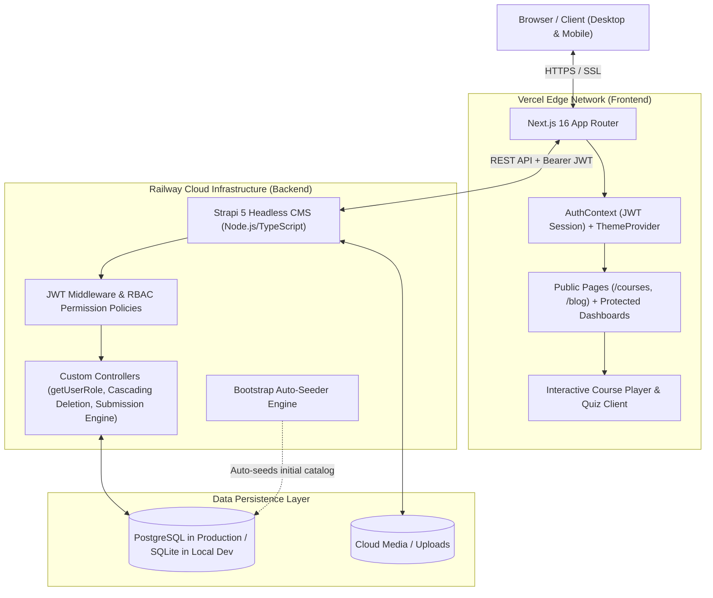
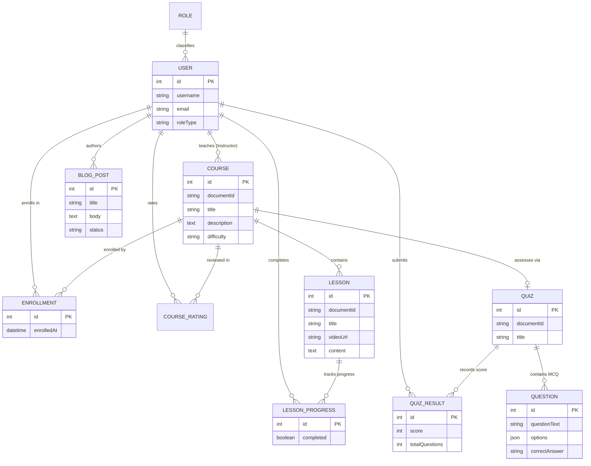
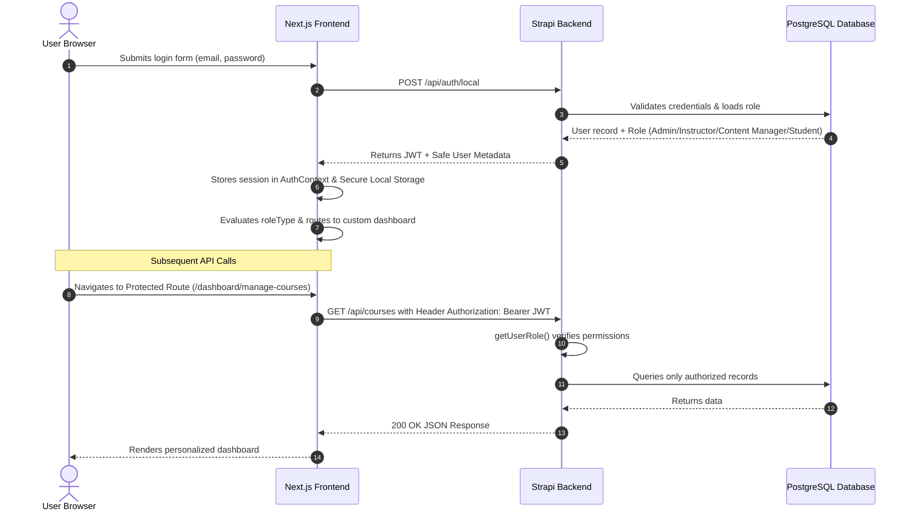
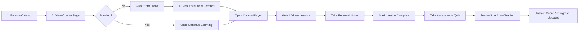
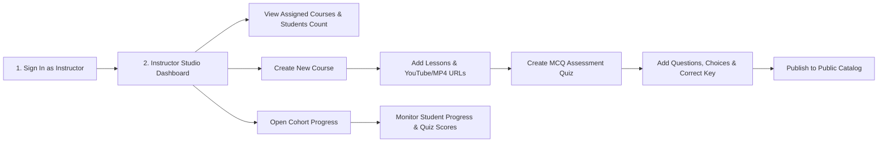
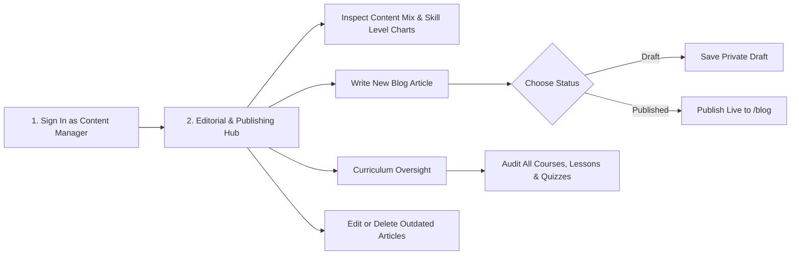
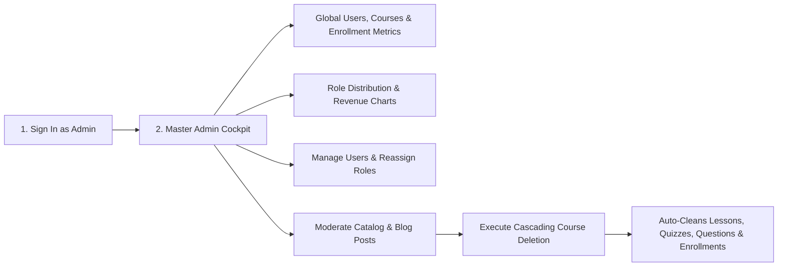

# 🎓 Next-Generation Learning Management System (LMS)

[](https://nextjs.org/)
[](https://strapi.io/)
[](https://www.typescriptlang.org/)
[](https://www.postgresql.org/)
[](https://tailwindcss.com/)
[](https://vercel.com/)

A modern, enterprise-grade, full-stack **Learning Management System (LMS)** built with **Next.js 16 (App Router)** and **Strapi 5 Headless CMS**. Engineered with robust Role-Based Access Control (RBAC), interactive video learning players, auto-graded MCQ assessment engines, editorial publishing workflows, and dynamic analytical dashboards for four distinct user roles.

---

## 🌐 Live Production Deployments

| Component | Platform | Live URL |
| :--- | :--- | :--- |
| **Frontend Web App** | Vercel | [https://learning-management-system-lms-five.vercel.app](https://learning-management-system-lms-five.vercel.app) |
| **Backend REST API** | Railway | [https://learning-management-system-lms-production.up.railway.app](https://learning-management-system-lms-production.up.railway.app) |
| **Strapi Admin Panel** | Railway | [https://learning-management-system-lms-production.up.railway.app/admin](https://learning-management-system-lms-production.up.railway.app/admin) |

---

## 🔑 Pre-Configured Demo Accounts

The database is automatically bootstrapped on first launch with courses, lessons, quizzes, articles, and sample users. You can immediately sign in at [`/login`](https://learning-management-system-lms-five.vercel.app/login) using any of the following accounts:

> **Universal Password for all Demo Accounts:** `Password123!`

| Role | Email | Password | Primary Focus & Dashboard Capabilities |
| :--- | :--- | :--- | :--- |
| **Admin** | `admin@demo.com` | `Password123!` | Global platform oversight, user role management, system-wide moderation, cascading database cleanup. |
| **Content Manager** | `content@demo.com` | `Password123!` | Editorial & Publishing Hub, article drafting/publishing, curriculum overview, content mix analytics. |
| **Instructor** | `instructor@demo.com` | `Password123!` | Sandboxed Course Studio, lesson & video manager, quiz builder, student cohort progress tracking. |
| **Student** | `student@demo.com` | `Password123!` | Course discovery, 1-click dynamic enrollment, video player, personal sticky notes, auto-graded quizzes. |
| **Student (100% Complete)** | `student2@demo.com` | `Password123!` | Perfect completion state across courses, 100% quiz scores, certificate-ready dashboard view. |
| **Student (50% In-Progress)** | `student3@demo.com` | `Password123!` | Active learning in progress with dynamic "Continue Learning" feed and partial quiz history. |

---

## 🏗️ Visual Architecture & System Diagrams

### 1. System & Technology Architecture



---

### 2. Database Entity-Relationship (ER) Model



---

### 3. Authentication & Authorization Flow



---

## 👥 Role Workflows: How Each Role Works

### 1. 🧑‍🎓 Student Workflow

Students are the learners on the platform. They discover courses, enroll in curriculum modules, stream video lessons, take notes, and take auto-graded quizzes to measure their mastery.



* **Dynamic Course Page CTA**: Detects user state automatically:
  * Guest visitor: Shows **"Sign in to Enroll"** &rarr; `/login`.
  * Logged in, not enrolled: Shows **"Enroll Now (Free)"** &rarr; 1-click instant enrollment.
  * Already enrolled: Shows **"Continue Learning &rarr;"** &rarr; jumps directly into the course player.
* **Persistent Progress & Notes**: Lesson checkboxes update database completion flags instantly; notes are synced locally per course.
* **Secure Quiz Room**: Questions and options are displayed without revealing answers. When submitted, the backend calculates the percentage and returns the result safely.

---

### 2. 👨‍🏫 Instructor Workflow

Instructors are educators who own their courses. They create curriculum structures, attach instructional videos, author quiz assessments with MCQ questions, and track enrolled student progress.



* **Sandboxed Ownership Model**: Instructors can only view, edit, or delete courses they authored.
* **Curriculum Builder**: Manage lessons, rearrange topics, and embed video URLs directly.
* **Quiz Creator**: Define custom multi-choice questions and set the server-validated answer keys.
* **Cohort Analytics**: Review student rosters and inspect how learners perform across their courses.

---

### 3. ✍️ Content Manager Workflow

Content Managers are editorial and curriculum supervisors. They oversee the blog publishing workflow, ensure course quality standards, and monitor overall platform content distribution.



* **Editorial Dashboard**: Live counters for Total Courses, Lessons, Articles (Published vs. Drafts), and Quizzes.
* **Interactive Visual Analytics**: Content Mix Pie Chart and Course Skill-Level Bar Chart powered by Recharts.
* **Article Publishing Suite**: Full CRUD operations for blog posts with status toggle (`Draft` vs. `Published`).
* **Curriculum Moderation**: Full access to review and adjust any course in the platform.

---

### 4. 🛡️ Admin Workflow

Admins possess master governance over the entire platform. They monitor global system metrics, assign and change user roles, moderate all content, and perform cascading database operations safely.



* **Master Cockpit**: Real-time metrics across all registered users, total courses, and platform enrollments.
* **User & Role Governance**: Assign roles (`Student`, `Instructor`, `Content Manager`, `Admin`) dynamically.
* **Cascading Deletion Engine**: Deleting a course cleanly removes all associated lessons, quizzes, questions, quiz results, enrollments, and ratings in a single transaction with zero PostgreSQL constraint errors.

---

## 📊 Complete Roles & Capabilities Matrix

| Capability / Resource | Student | Instructor | Content Manager | Admin |
| :--- | :---: | :---: | :---: | :---: |
| **View Course Catalog & Read Published Blogs** | ✅ | ✅ | ✅ | ✅ |
| **Enroll in Courses (Dynamic CTA Button)** | ✅ | ❌ | ❌ | ❌ |
| **Stream Lessons & Toggle Completion** | ✅ | Preview | Preview | Preview |
| **Take Quizzes & Auto-Score Calculation** | ✅ | ❌ | ❌ | ❌ |
| **Personal Notes Saver (Per Course)** | ✅ | ❌ | ❌ | ❌ |
| **Create & Edit Courses** | ❌ | ✅ (Own Only) | ✅ (All) | ✅ (All) |
| **Add Lessons & Video Embeds** | ❌ | ✅ (Own Only) | ✅ (All) | ✅ (All) |
| **Create & Edit Quizzes with MCQ Questions** | ❌ | ✅ (Own Only) | ✅ (All) | ✅ (All) |
| **Track Enrolled Students & Cohort Grades** | ❌ | ✅ (Own Courses) | ✅ (All) | ✅ (All) |
| **Write, Edit & Publish Blog Posts** | ❌ | ❌ | ✅ | ✅ |
| **Access Editorial Hub & Content Mix Charts** | ❌ | ❌ | ✅ | ✅ |
| **Access Master System Analytics & Charts** | ❌ | ❌ | ❌ | ✅ |
| **Change User Roles & Manage Accounts** | ❌ | ❌ | ❌ | ✅ |
| **Cascading Database Course Deletion** | ❌ | ✅ (Own Only) | ✅ | ✅ |

---

## 📂 Repository Directory Breakdown

```
Learning-Management-System-LMS-/
├── backend/                             # Strapi 5 Headless CMS (Node.js / TypeScript)
│   ├── config/                          # Server, database, admin, and plugin configs
│   │   ├── database.ts                  # Dual SQLite (local) & PostgreSQL (production) driver
│   │   ├── middlewares.ts               # CORS, security headers, and body parser settings
│   │   └── plugins.ts                   # Users & Permissions plugin configuration
│   ├── src/
│   │   ├── api/                         # Content Type Modules & Business Logic
│   │   │   ├── blog-post/               # Blog articles with Draft/Published workflow & delete handler
│   │   │   ├── course/                  # Courses with instructor relations & cascading delete
│   │   │   ├── course-rating/           # Student star ratings & reviews
│   │   │   ├── custom-auth/             # Custom registration & role resolution endpoints
│   │   │   ├── enrollment/              # Student course enrollments
│   │   │   ├── lesson/                  # Video / Text lessons with progress links
│   │   │   ├── lesson-progress/         # Lesson completion tracking per student
│   │   │   ├── question/                # MCQ questions with server-side validation
│   │   │   ├── quiz/                    # Quizzes & auto-submission grading engine
│   │   │   └── quiz-result/             # Graded quiz submission history
│   │   └── index.ts                     # Database bootstrap & auto-seeding engine
│   ├── package.json
│   └── tsconfig.json
│
└── frontend/                            # Next.js 16 Web Application (App Router)
    ├── src/
    │   ├── app/                         # App Router Pages & Layouts
    │   │   ├── layout.tsx               # Root layout with ThemeProvider & AuthProvider
    │   │   ├── page.tsx                 # Public homepage with course hero & catalog
    │   │   ├── (auth)/
    │   │   │   ├── login/page.tsx       # Authentication sign-in
    │   │   │   └── register/page.tsx    # Multi-role student / instructor registration
    │   │   ├── blog/                    # Public blog catalog and article details
    │   │   ├── courses/[id]/page.tsx    # Dynamic public course preview & smart CTA
    │   │   └── dashboard/               # Role-Aware Management Suite
    │   │       ├── page.tsx             # Dynamic Dashboard Role Router
    │   │       ├── AdminOverview.tsx    # Admin system health & user metrics
    │   │       ├── ContentManagerOverview.tsx # Editorial publishing metrics & content charts
    │   │       ├── InstructorOverview.tsx     # Instructor course studio & cohort metrics
    │   │       ├── courses/[id]/learn/  # Interactive video player & quiz room
    │   │       ├── manage-courses/      # Course curriculum & quiz editor
    │   │       ├── blogs/               # Article writer & editor (Draft/Publish)
    │   │       └── admin/users/         # User role assignment panel
    │   ├── components/                  # Reusable UI components
    │   │   ├── PublicNavbar.tsx         # Solid, theme-aware public navigation header
    │   │   ├── EnrollButton.tsx         # Smart dynamic enrollment & CTA button
    │   │   ├── ProtectedRoute.tsx       # Client-side RBAC route guard
    │   │   └── ThemeToggle.tsx          # Light/Dark mode switcher
    │   └── context/
    │       └── AuthContext.tsx          # User session, JWT persistence, and role context
    ├── package.json
    └── next.config.ts
```

---

## ⚡ Quick Start: Running Locally (Step-by-Step)

Follow these simple instructions to run both the backend and frontend on your local computer in under 5 minutes.

### 📋 Prerequisites

* **Node.js**: Version `18.x`, `20.x`, or `22.x` ([Download Node.js](https://nodejs.org/))
* **Git**: ([Download Git](https://git-scm.com/))
* **npm**: (Installed automatically with Node.js)

---

### Step 1: Clone the Repository

Open your terminal or command prompt and clone the project:

```bash
git clone https://github.com/SnoOpWo0t/Learning-Management-System-LMS-.git
cd Learning-Management-System-LMS-
```

---

### Step 2: Start the Backend (Strapi API)

1. Open your terminal and navigate to `backend/`:
   ```bash
   cd backend
   ```

2. Install all backend dependencies:
   ```bash
   npm install
   ```

3. Create your `.env` file in the `backend/` directory:
   ```env
   HOST=0.0.0.0
   PORT=1337
   APP_KEYS=wPD3TubNMyNkgSR8CWUTCw==,HVb+CNHa/C8hEDinOJZb0g==,vobo3gEuTmbvSy6mwUNbGA==,KcimxQZ62eR31WPtFzHOKg==
   API_TOKEN_SALT=8SSyvlvZJrPxwHETpOvm1w==
   ADMIN_JWT_SECRET=CGJHv/v4N8PW2p/uhmOP6A==
   JWT_SECRET=jaafbpS0XdVX+i5CXuj+yg==
   TRANSFER_TOKEN_SALT=dmS9RlHq9i+t4ZJoI9gOQQ==
   ENCRYPTION_KEY=OM9x2YfKwl9e1m4Hf6+Rag==

   # Local SQLite Database (Created automatically)
   DATABASE_CLIENT=sqlite
   DATABASE_FILENAME=.tmp/data.db
   ```

4. Start the backend development server:
   ```bash
   npm run dev
   ```

> 💡 **Automatic Database Initialization:**
> Strapi will create `backend/.tmp/data.db`, execute all migrations, auto-grant API permissions, seed demo courses, lessons, quizzes, and generate the demo accounts (`admin@demo.com`, etc.).
> * **API Endpoint**: `http://localhost:1337`
> * **CMS Admin Panel**: `http://localhost:1337/admin`

---

### Step 3: Start the Frontend (Next.js)

1. Open a **second terminal window** and navigate to `frontend/`:
   ```bash
   cd frontend
   ```

2. Install all frontend dependencies:
   ```bash
   npm install
   ```

3. Create your `.env.local` file in the `frontend/` directory:
   ```env
   NEXT_PUBLIC_API_URL=http://localhost:1337
   ```

4. Start the Next.js development server:
   ```bash
   npm run dev
   ```

5. Open your web browser and navigate to:
   ```
   http://localhost:3000
   ```

You are ready! Sign in using any demo account from the table above with password `Password123!`.

---

## 🚀 Production Deployment Manual

### 1. Backend on Railway (with PostgreSQL)

1. Create a project on [Railway](https://railway.com/) and add a **PostgreSQL** database service.
2. Link your GitHub repository and set the root directory to `/backend`.
3. In the Railway Service **Variables** tab, configure:
   ```env
   HOST=0.0.0.0
   PORT=1337
   NODE_ENV=production
   
   # Security Keys
   APP_KEYS=your_generated_app_keys
   API_TOKEN_SALT=your_api_token_salt
   ADMIN_JWT_SECRET=your_admin_jwt_secret
   JWT_SECRET=your_jwt_secret
   TRANSFER_TOKEN_SALT=your_transfer_token_salt
   ENCRYPTION_KEY=your_encryption_key
   
   # PostgreSQL Connection (Use Railway Variable References)
   DATABASE_CLIENT=postgres
   DATABASE_HOST=${{Postgres.PGHOST}}
   DATABASE_PORT=${{Postgres.PGPORT}}
   DATABASE_NAME=${{Postgres.PGDATABASE}}
   DATABASE_USERNAME=${{Postgres.PGUSER}}
   DATABASE_PASSWORD=${{Postgres.PGPASSWORD}}
   DATABASE_SSL=false
   ```
4. Set **Build Command**: `npm run build`
5. Set **Start Command**: `npm run start`

---

### 2. Frontend on Vercel

1. Import the repository into [Vercel](https://vercel.com/).
2. Set the **Root Directory** to `frontend`.
3. Under **Environment Variables**, provide your live Railway URL:
   ```env
   NEXT_PUBLIC_API_URL=https://your-backend-railway-url.up.railway.app
   ```
4. Click **Deploy**. Vercel will build and distribute the Next.js App Router globally on its edge network.

---

## 🛡️ Key Architectural & Security Features

* **Server-Side MCQ Auto-Grading**: Answers are verified strictly within `backend/src/api/quiz/controllers/quiz.ts`. The client never receives correct keys in JSON payloads, eliminating cheating via DevTools.
* **Cascading Relational Deletion**: Course deletion triggers an automated cleanup of child lessons, progress trackers, quizzes, questions, submissions, enrollments, and reviews via direct database queries, ensuring PostgreSQL integrity without orphan records.
* **Dynamic Role Gatekeeping (`getUserRole`)**: Strapi v5 custom controller layer dynamically resolves user roles from the database to securely enforce permission policies across Admin, Content Manager, Instructor, and Student actions.
* **Responsive Smart CTA**: Public course previews inspect client authentication and enrollment state in real-time, displaying `Sign in to Enroll`, `Enroll Now (Free)`, or `Continue Learning →` accordingly.

---

## 📝 License

This project is open-source and released under the **MIT License**.
