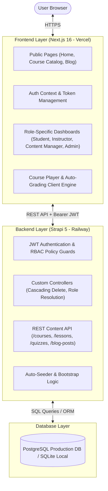

# 🎓 Next-Generation Learning Management System (LMS)

[](https://nextjs.org/)
[](https://strapi.io/)
[](https://www.typescriptlang.org/)
[](https://www.postgresql.org/)
[](https://tailwindcss.com/)
[](https://vercel.com/)

A modern, enterprise-grade, full-stack **Learning Management System (LMS)** built with **Next.js 16 (App Router)** and **Strapi 5 Headless CMS**. Designed with strict Role-Based Access Control (RBAC), interactive video learning players, auto-graded MCQ assessments, editorial publishing workflows, and dynamic analytical dashboards for four distinct user roles.

---

## 🌐 Live Production Deployments

| Component | Platform | Live URL |
| :--- | :--- | :--- |
| **Frontend Web App** | Vercel | [https://learning-management-system-lms-five.vercel.app](https://learning-management-system-lms-five.vercel.app) |
| **Backend REST API** | Railway | [https://learning-management-system-lms-production.up.railway.app](https://learning-management-system-lms-production.up.railway.app) |
| **Strapi Admin Panel** | Railway | [https://learning-management-system-lms-production.up.railway.app/admin](https://learning-management-system-lms-production.up.railway.app/admin) |

---

## 🔑 Pre-Configured Demo Accounts

The database is automatically bootstrapped with full courses, lessons, quizzes, articles, and sample users. You can immediately sign in at [`/login`](https://learning-management-system-lms-five.vercel.app/login) using any of the following accounts:

> **Universal Password for all Demo Accounts:** `Password123!`

| Role | Email | Password | What You Can Explore |
| :--- | :--- | :--- | :--- |
| **Admin** | `admin@demo.com` | `Password123!` | Global platform analytics, user role management, system-wide course & blog moderation, database cleanup. |
| **Content Manager** | `content@demo.com` | `Password123!` | Editorial & Publishing Hub, blog writing (Draft/Publish), course curriculum oversight, content mix analytics. |
| **Instructor** | `instructor@demo.com` | `Password123!` | Course Studio, curriculum builder (lessons & quizzes), student enrollment tracking, cohort progress monitoring. |
| **Student** | `student@demo.com` | `Password123!` | Course discovery, 1-click dynamic enrollment, video player, personal note taking, auto-graded quizzes. |
| **Student (100% Complete)** | `student2@demo.com` | `Password123!` | Perfect completion state across courses, 100% quiz scores, certificate-ready dashboard. |
| **Student (50% In-Progress)** | `student3@demo.com` | `Password123!` | Active learning in progress with dynamic "Continue Learning" card and partial quiz scores. |

---

## 🏗️ Information & System Architecture

### 1. High-Level Architecture Diagram



---

### 2. Role-Based Feature Matrix

| Feature / Capability | Student | Instructor | Content Manager | Admin |
| :--- | :---: | :---: | :---: | :---: |
| **Browse Public Courses & Published Blogs** | ✅ | ✅ | ✅ | ✅ |
| **Enroll in Courses (Dynamic 1-Click CTA)** | ✅ | ❌ | ❌ | ❌ |
| **Interactive Video Player & Lesson Completion** | ✅ | Preview | Preview | Preview |
| **Take Quizzes & Receive Instant Auto-Grading** | ✅ | ❌ | ❌ | ❌ |
| **Personal Sticky Notes per Course** | ✅ | ❌ | ❌ | ❌ |
| **Create & Manage Assigned Courses / Lessons** | ❌ | ✅ (Own Only) | ✅ (All) | ✅ (All) |
| **Create & Manage Assessment Quizzes & Questions** | ❌ | ✅ (Own Only) | ✅ (All) | ✅ (All) |
| **Track Enrolled Students & Cohort Progress** | ❌ | ✅ (Own Courses) | ✅ (All) | ✅ (All) |
| **Write & Publish Articles (Draft/Publish Workflow)** | ❌ | ❌ | ✅ | ✅ |
| **Content Mix & Editorial Performance Analytics** | ❌ | ❌ | ✅ | ✅ |
| **Platform Analytics & System User Management** | ❌ | ❌ | ❌ | ✅ |
| **Cascading Database Course Deletion** | ❌ | ✅ (Own Only) | ✅ | ✅ |

---

## 📂 Repository Directory Structure

```
Learning-Management-System-LMS-/
├── backend/                             # Strapi 5 Headless CMS (Node.js / TypeScript)
│   ├── config/                          # Server, database, admin, and plugin configs
│   │   ├── database.ts                  # Dual SQLite (local) & PostgreSQL (production) driver
│   │   ├── middlewares.ts               # CORS, security headers, and body parser settings
│   │   └── plugins.ts                   # Users & Permissions plugin configuration
│   ├── src/
│   │   ├── api/                         # Content Type Modules
│   │   │   ├── blog-post/               # Blog articles with Draft/Published workflow
│   │   │   ├── course/                  # Courses with instructor relations & cascading delete
│   │   │   ├── course-rating/           # Student star ratings & reviews
│   │   │   ├── custom-auth/             # Custom registration & role resolution endpoints
│   │   │   ├── enrollment/              # Student course enrollments
│   │   │   ├── lesson/                  # Video / Text lessons
│   │   │   ├── lesson-progress/         # Lesson completion tracking per student
│   │   │   ├── question/                # MCQ questions with server-side validation
│   │   │   ├── quiz/                    # Quizzes & auto-submission grading engine
│   │   │   └── quiz-result/             # Graded quiz submission history
│   │   └── index.ts                     # Database bootstrap & auto-seeding engine
│   ├── package.json
│   └── tsconfig.json
│
└── frontend/                            # Next.js 16 Web Application (App Router)
    ├── src/
    │   ├── app/                         # App Router Pages & Routes
    │   │   ├── layout.tsx               # Root layout with ThemeProvider & AuthProvider
    │   │   ├── page.tsx                 # Public homepage with course hero & catalog
    │   │   ├── (auth)/
    │   │   │   ├── login/page.tsx       # Authentication sign-in
    │   │   │   └── register/page.tsx    # Multi-role student / instructor registration
    │   │   ├── blog/                    # Public blog catalog and article details
    │   │   ├── courses/[id]/page.tsx    # Dynamic public course preview & smart CTA
    │   │   └── dashboard/               # Role-Aware Management Suite
    │   │       ├── page.tsx             # Dynamic Dashboard Switcher
    │   │       ├── AdminOverview.tsx    # Admin system health & user metrics
    │   │       ├── ContentManagerOverview.tsx # Editorial publishing metrics & content charts
    │   │       ├── InstructorOverview.tsx     # Instructor course studio & cohort metrics
    │   │       ├── courses/[id]/learn/  # Interactive video player & quiz room
    │   │       ├── manage-courses/      # Course curriculum & quiz editor
    │   │       ├── blogs/               # Article writer & editor (Draft/Publish)
    │   │       └── admin/users/         # User role assignment panel
    │   ├── components/                  # Reusable UI components
    │   │   ├── PublicNavbar.tsx         # Solid, theme-aware public header
    │   │   ├── EnrollButton.tsx         # Smart authentication & enrollment CTA
    │   │   ├── ProtectedRoute.tsx       # Client-side RBAC route guard
    │   │   └── ThemeToggle.tsx          # Light/Dark mode switcher
    │   └── context/
    │       └── AuthContext.tsx          # User session, JWT persistence, and role context
    ├── package.json
    └── next.config.ts
```

---

## ⚡ Quick Start: Running the Project Locally

Follow these step-by-step instructions to get the complete project running on your local machine in less than 5 minutes.

### 📋 Prerequisites

Make sure you have the following installed:
* **Node.js**: Version `18.x`, `20.x`, or `22.x` ([Download Node.js](https://nodejs.org/))
* **Git**: ([Download Git](https://git-scm.com/))
* **npm**: (Comes packaged with Node.js)

---

### Step 1: Clone the Repository

Open your terminal or command prompt and clone the project:

```bash
git clone https://github.com/SnoOpWo0t/Learning-Management-System-LMS-.git
cd Learning-Management-System-LMS-
```

---

### Step 2: Start the Backend (Strapi API)

1. Navigate to the `backend` folder:
   ```bash
   cd backend
   ```

2. Install dependencies:
   ```bash
   npm install
   ```

3. Create your local environment file:
   Create a file named `.env` inside `backend/` with the following content:
   ```env
   HOST=0.0.0.0
   PORT=1337
   APP_KEYS=wPD3TubNMyNkgSR8CWUTCw==,HVb+CNHa/C8hEDinOJZb0g==,vobo3gEuTmbvSy6mwUNbGA==,KcimxQZ62eR31WPtFzHOKg==
   API_TOKEN_SALT=8SSyvlvZJrPxwHETpOvm1w==
   ADMIN_JWT_SECRET=CGJHv/v4N8PW2p/uhmOP6A==
   JWT_SECRET=jaafbpS0XdVX+i5CXuj+yg==
   TRANSFER_TOKEN_SALT=dmS9RlHq9i+t4ZJoI9gOQQ==
   ENCRYPTION_KEY=OM9x2YfKwl9e1m4Hf6+Rag==

   # Local Database (Uses SQLite file automatically)
   DATABASE_CLIENT=sqlite
   DATABASE_FILENAME=.tmp/data.db
   ```

4. Launch the Strapi development server:
   ```bash
   npm run dev
   ```

> 💡 **What happens on first boot:**
> Strapi will create the local SQLite database at `backend/.tmp/data.db`, automatically run all migrations, seed all demo courses, lessons, quizzes, blog articles, and generate the demo user accounts.
> * **Backend API URL**: `http://localhost:1337`
> * **Strapi Admin Panel**: `http://localhost:1337/admin`

---

### Step 3: Start the Frontend (Next.js)

Open a **new terminal tab or window** and follow these steps:

1. Navigate to the `frontend` folder:
   ```bash
   cd frontend
   ```

2. Install dependencies:
   ```bash
   npm install
   ```

3. Create your local environment file:
   Create a file named `.env.local` inside `frontend/` with the following line:
   ```env
   NEXT_PUBLIC_API_URL=http://localhost:1337
   ```

4. Launch the Next.js development server:
   ```bash
   npm run dev
   ```

5. Open your browser and visit:
   ```
   http://localhost:3000
   ```

You can now log in with `admin@demo.com`, `content@demo.com`, `instructor@demo.com`, or `student@demo.com` (password: `Password123!`).

---

## 🚀 Deployment Guide (Production Setup)

### 1. Backend Deployment (Railway with PostgreSQL)

1. Create a new project on [Railway](https://railway.com/) and add a **PostgreSQL** database service.
2. Connect your GitHub repository and select the root directory with the root directory set to `/backend`.
3. In the Railway Service **Variables** tab, configure the following environment variables:
   ```env
   HOST=0.0.0.0
   PORT=1337
   NODE_ENV=production
   
   # Strapi Secrets (Generate random 32-char strings)
   APP_KEYS=your_app_keys_here
   API_TOKEN_SALT=your_api_token_salt
   ADMIN_JWT_SECRET=your_admin_jwt_secret
   JWT_SECRET=your_jwt_secret
   TRANSFER_TOKEN_SALT=your_transfer_token_salt
   ENCRYPTION_KEY=your_encryption_key
   
   # PostgreSQL Connection (Use Railway Reference Variables)
   DATABASE_CLIENT=postgres
   DATABASE_HOST=${{Postgres.PGHOST}}
   DATABASE_PORT=${{Postgres.PGPORT}}
   DATABASE_NAME=${{Postgres.PGDATABASE}}
   DATABASE_USERNAME=${{Postgres.PGUSER}}
   DATABASE_PASSWORD=${{Postgres.PGPASSWORD}}
   DATABASE_SSL=false
   ```
4. Set the **Build Command** to:
   ```bash
   npm run build
   ```
5. Set the **Start Command** to:
   ```bash
   npm run start
   ```

---

### 2. Frontend Deployment (Vercel)

1. Import the repository into [Vercel](https://vercel.com/).
2. Set the **Root Directory** to `frontend`.
3. Under **Environment Variables**, add:
   ```env
   NEXT_PUBLIC_API_URL=https://your-backend-railway-url.up.railway.app
   ```
4. Deploy! Vercel will automatically build the Next.js application and deploy it to a global edge network.

---

## 🛡️ Security & Business Logic Highlights

1. **Server-Side Quiz Verification**: Correct quiz answers are evaluated directly on the server. The client only receives the final percentage score and total question count, completely preventing answer inspection via browser DevTools.
2. **Cascading Relational Deletion**: Deleting a course automatically removes all dependent lessons, lesson progress trackers, quizzes, questions, quiz results, enrollments, and ratings via direct database transactions, avoiding foreign-key constraint violations in PostgreSQL.
3. **Dynamic Role Resolution**: Strapi custom controllers use dynamic role resolution (`getUserRole`) to accurately enforce permissions for Admin, Content Manager, Instructor, and Student accounts.
4. **Smart Dynamic Course Preview**: The public course page dynamically detects the user's authentication and enrollment status, transitioning seamlessly between `Sign In to Enroll`, `Enroll Now (Free)`, and `Continue Learning →`.

---

## 📝 License

This project is open-source and available under the **MIT License**.
